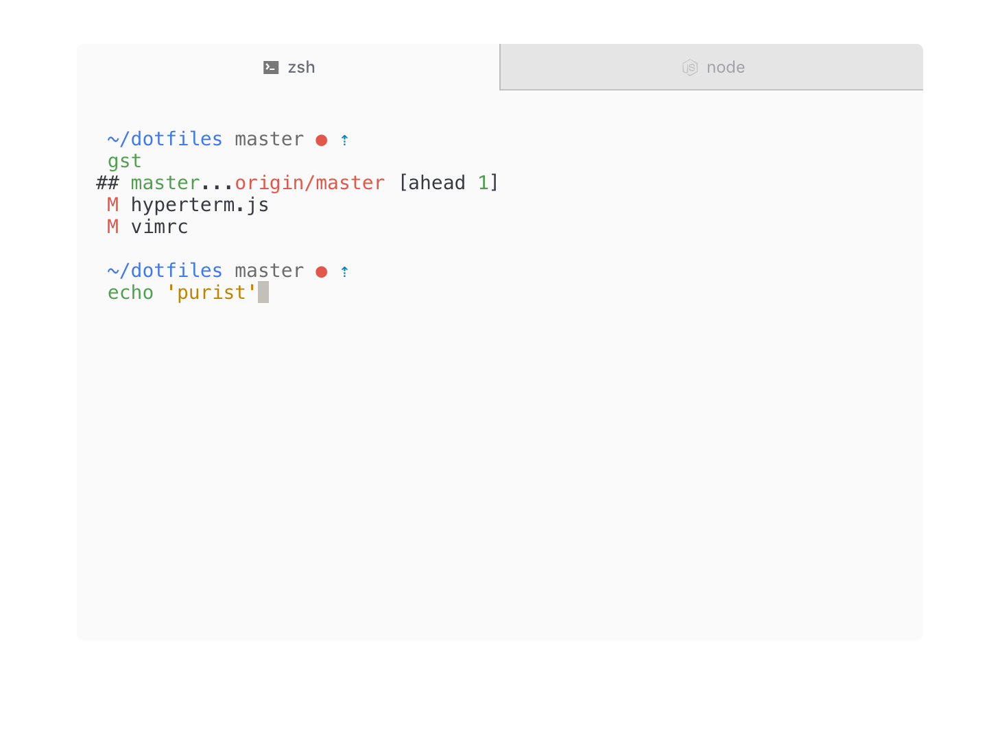

# Purist

> A ZSH prompt for purists




## Overview

`purist` is a soft-spoken but eloquent ZSH prompt. Forked from
[sindresorhus/pure](https://github.com/sindresorhus/pure).

### Details

- Comes without prompt character.
- Shows `git` branch and whether it's dirty (with a red `●`).
- Indicates when you have unpushed/unpulled `git` commits with up/down arrows. *(Check is done asynchronously!)*
- Command execution time will be displayed if it exceeds the set threshold.
- Username and host only displayed when in an SSH session.
- Shows the current path in the title and the when a process is running.

## Install

Can be installed with `npm` or manually. Requires git 2.0.0+ and ZSH 5.0.0+.

### npm

```console
$ npm install --global purist
```

That's it. Skip to [Getting started](#getting-started).

### Manually

1. Either…
  - Clone this repo
  - add it as a submodule, or
  - just download `purist.zsh` and `async.zsh`

2. Symlink `purist.zsh` to somewhere in [`$fpath`](http://www.refining-linux.org/archives/46/ZSH-Gem-12-Autoloading-functions/) with the name `prompt_purist_setup`.

3. Symlink `async.zsh` in `$fpath` with the name `async`.

#### Example

```console
$ ln -s "$PWD/purist.zsh" /usr/local/share/zsh/site-functions/prompt_purist_setup
$ ln -s "$PWD/async.zsh" /usr/local/share/zsh/site-functions/async
```
*Run `echo $fpath` to see possible locations.*

For a user-specific installation (which would not require escalated privileges), simply add a directory to `$fpath` for that user:

```sh
# .zshenv or .zshrc
fpath=( "$HOME/.zfunctions" $fpath )
```

Then install the theme there:

```console
$ ln -s "$PWD/purist.zsh" "$HOME/.zfunctions/prompt_purist_setup"
$ ln -s "$PWD/async.zsh" "$HOME/.zfunctions/async"
```


## Getting started

Initialize the prompt system (if not so already) and choose `purist`:

```sh
# .zshrc
autoload -U promptinit && promptinit
prompt purist
```


## Options

### `PURE_CMD_MAX_EXEC_TIME`

The max execution time of a process before its run time is shown when it exits. Defaults to `5` seconds.

### `PURE_GIT_PULL`

Set `PURE_GIT_PULL=0` to prevent Purist from checking whether the current Git remote has been updated.

### `PURE_GIT_UNTRACKED_DIRTY`

Set `PURE_GIT_UNTRACKED_DIRTY=0` to not include untracked files in dirtiness check. Only really useful on extremely huge repos like the WebKit repo.

### `PURE_GIT_DELAY_DIRTY_CHECK`

Time in seconds to delay git dirty checking for large repositories (git status takes > 2 seconds). The check is performed asynchronously, this is to save CPU. Defaults to `1800` seconds.

### `PURE_PROMPT_SYMBOL`

Defines the prompt symbol. The default value is ` `.

### `PURE_GIT_DOWN_ARROW`

Defines the git down arrow symbol. The default value is `⇣`.

### `PURE_GIT_UP_ARROW`

Defines the git up arrow symbol. The default value is `⇡`.

## Example

```sh
# .zshrc
autoload -U promptinit && promptinit

# optionally define some options
PURE_CMD_MAX_EXEC_TIME=10

prompt purist
```

## Tips

In the screenshot you see Purist running in [HyperTerm](https://hyperterm.org) with the [hyperterm-one-light](https://github.com/andrepolischuk/hyperterm-one-light) theme and Menlo font.

To have commands colorized as seen in the screenshot, install [zsh-syntax-highlighting](https://github.com/zsh-users/zsh-syntax-highlighting).

## Related

- [sindresorhus/pure](https://github.com/sindresorhus/pure) Original repository

## License

MIT © [Bram Kok](https://bramkok.com)
